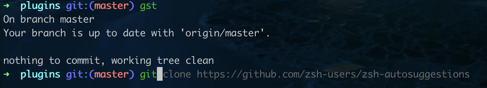

# 终端命令组合与美化
>一键安装常用的终端插件，组合常用的命令，让你少敲几下键盘
## 效果(简写、提示、高亮)

## 使用说明:
1. `sh -c "$(curl -fsSL https://raw.github.com/crowphy/terminal-enhance/master/index.sh)"`
2. `source ~/.zshrc`

## 插件
1. 命令提示: `zsh-autosuggestions`
2. 语法高亮: `zsh-syntax-highlighting`
## 别名
```shell
alias gn="git clone"

alias gst="git status"
alias gct="git checkout"
alias gcb="git checkout -b"
alias gcm="git commit -m"
#拉取当前分支
alias gl="git pull"
#拉取当前分支并从master分支rebase
alias glm="git pull --rebase origin master"
#推送到当前分支
alias gp='echo 当前分支： $(git branch --show-current) && git push --force --set-upstream origin $(git branch --show-current)'
#先从master分支rebase再推送到当前分支
gpr () { cd $(git rev-parse --show-toplevel) && git add . && git commit -m "$1" && git pull --rebase origin master && gp }

#解决冲突
alias grc="git add . && git rebase --continue"
alias grs="git add . && git rebase --skip"
alias gra="git add . && git rebase --abort"
```

## 其他
如果想添加其他命令别名可以直接编辑该目录下的`.cmdrc`即可，如果有其他共享的可以直接提mr合入或者提issue